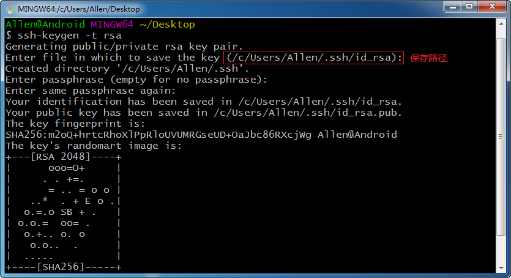
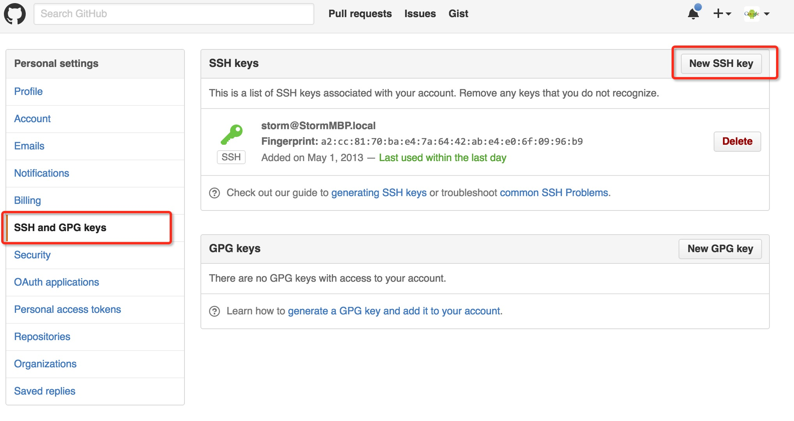
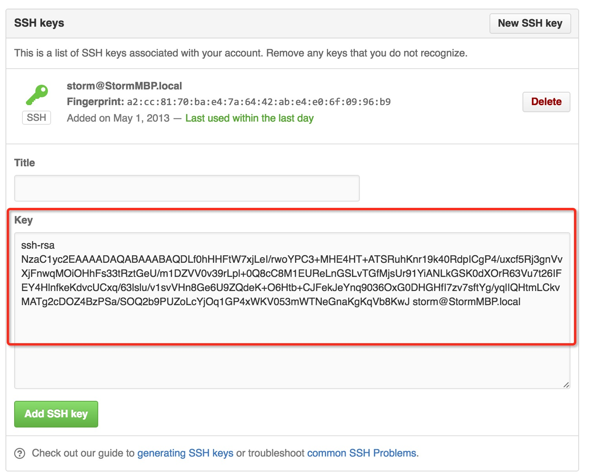
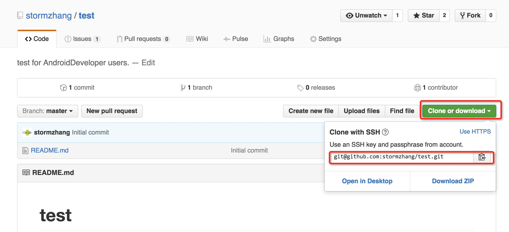

# 从0开始学习 GitHub 系列之「04.向GitHub 提交代码」

之前的这篇文章「[从0开始学习 GitHub 系列之「Git速成」](http://stormzhang.com/github/2016/05/30/learn-github-from-zero3/)」相信大家都已经对 [Git](http://lib.csdn.net/base/git) 的基本操作熟悉了，但是这篇文章只介绍了对本地 Git 仓库的基本操作，今天我就来介绍下如何跟远程仓库一起协作，教你们向 GitHub 上提交你们的第一行代码！

## 1. SSH

你拥有了一个 GitHub 账号之后，就可以自由的 clone 或者下载其他项目，也可以创建自己的项目，但是你没法提交代码。仔细想想也知道，肯定不可能随意就能提交代码的，如果随意可以提交代码，那么 GitHub 上的项目岂不乱了套了，所以提交代码之前一定是需要某种授权的，而 GitHub 上一般都是基于 SSH 授权的。

那么什么是 SSH 呢？

简单点说，SSH是一种网络协议，用于计算机之间的加密登录。目前是每一台 [Linux](http://lib.csdn.net/base/linux) 电脑的标准配置。而大多数 Git 服务器都会选择使用 SSH 公钥来进行授权，所以想要在 GitHub 提交代码的第一步就是要先添加 SSH key 配置。

## 2. 生成SSH key

Linux 与 Mac 都是默认安装了 SSH ，而 Windows 系统安装了 Git Bash 应该也是带了 SSH 的。大家可以在终端（win下在 Git Bash 里）输入 ssh 如果出现以下提示证明你本机已经安装 SSH， 否则请搜索自行安装下。


紧接着输入 **ssh-keygen -t rsa** ，什么意思呢？就是指定 rsa [算法](http://lib.csdn.net/base/datastructure)生成密钥，接着连续三个回车键（不需要输入密码），然后就会生成两个文件 id_rsa 和 id_rsa.pub ，而 id_rsa 是密钥，id_rsa.pub 就是公钥。这两文件默认分别在如下目录里生成：

Linux/Mac 系统 在 **~/.ssh** 下，win系统在 **/c/Documents and Settings/username/.ssh** 下，都是隐藏文件，相信你们有办法查看的。



接下来要做的是把 id_rsa.pub 的内容添加到 GitHub 上，这样你本地的 id_rsa 密钥跟 GitHub 上的 id_rsa.pub 公钥进行配对，授权成功才可以提交代码。

## 3. GitHub 上添加 SSH key

第一步先在 GitHub 上的设置页面，点击最左侧 SSH and GPG keys ：



然后点击右上角的 New SSH key 按钮：



需要做的只是在 Key 那栏把 id_rsa.pub 公钥文件里的内容复制粘贴进去就可以了（上述示例为了安全粘贴的公钥是无效的），Title 那栏不需要填写，点击 Add SSH key 按钮就ok了。

这里提醒下，怎么查看 id_rsa.pub 文件的内容？

Linux/Mac 用户执行以下命令：

```bash
cd ~/.ssh
cat id_rsa.pub
```

Windows用户，设置显示隐藏文件，可以使用 EditPlus 或者 Sublime 打开复制就行了。

SSH key 添加成功之后，输入 **ssh -T git@github.com** 进行[测试](http://lib.csdn.net/base/softwaretest)，如果出现以下提示证明添加成功了。


## 4. Push & Pull

在提交代码之前我们先要了解两个命令，也是上次的文章没有介绍的，因为这两个命令需要跟远程仓库配合。

Push ：直译过来就是「推」的意思，什么意思呢？如果你本地代码有更新了，那么就需要把本地代码推到远程仓库，这样本地仓库跟远程仓库就可以保持同步了。

代码示例： **git push origin master**

意思就是把本地代码推到远程 master 分支。

Pull：直译过来就是「拉」的意思，如果别人提交代码到远程仓库，这个时候你需要把远程仓库的最新代码拉下来，然后保证两端代码的同步。

代码示例： **git pull origin master**

意思就是把远程最新的代码更新到本地。一般我们在 push 之前都会先 pull ，这样不容易冲突。

## 5. 提交代码

添加 SSH key 成功之后，我们就有权限向 GitHub 上我们自己的项目提交代码了，而提交代码有两种方法：

Clone自己的项目		
我以我在 GitHub 上创建的 test 项目为例，执行如下命令：

```bash
git clone git@github.com:stormzhang/test.git
```

这样就把 test 项目 clone 到了本地，你可以把 clone 命令理解为高级点的复制，这个时候该项目本身就已经是一个git 仓库了，不需要执行 **git init** 进行初始化，而且甚至都已经关联好了远程仓库，我们只需要在这个 test 目录下任意修改或者添加文件，然后进行 commit ，之后就可以执行：

```bash
git push origin master
```

进行代码提交，这种是最简单方便的一种方式。

至于怎么获取项目的仓库地址呢？如下图：



关联本地已有项目
如果我们本地已经有一个完整的 git 仓库，并且已经进行了很多次 commit ，这个时候第一种方法就不适合了。

假设我们本地有个 test2 的项目，我们需要的是在 GitHub 上建一个 test 的项目，然后把本地 test2 上的所有代码 commit 记录提交到 GitHub 上的 test 项目。

第一步就是在 GitHub 上建一个 test 项目，这个想必大家都会了，就不用多讲了。

第二步把本地 test2 项目与 GitHub 上的 test 项目进行关联，切换到 test2 目录，执行如下命令：

```bash
git remote add origin git@github.com:stormzhang/test.git
```

什么意思呢？就是添加一个远程仓库，他的地址是 **git@github.com:stormzhang/test.git** ，而 origin 是给这个项目的远程仓库起的名字，是的，名字你可以随便取，只不过大家公认的只有一个远程仓库时名字就是 origin ，为什么要给远程仓库取名字？因为我们可能一个项目有多个远程仓库？比如 GitHub 一个，比如公司一个，这样的话提交到不同的远程仓库就需要指定不同的仓库名字了。

查看我们当前项目有哪些远程仓库可以执行如下命令：

```bash
git remote -v
```

接下来，我们本地的仓库就可以向远程仓库进行代码提交了：

```bash
git push origin master
```

就是默认向 GitHub 上的 test 目录提交了代码，而这个代码是在 master 分支。当然你可以提交到指定的分支，这个之后的文章再详细讲解。

对了，友情提醒，在提交代码之前先要设置下自己的用户名与邮箱，这些信息会出现在所有的 commit 记录里，执行以下代码就可以设置：

```bash
git config --global user.name "stormzhang"
git config --global user.email "stormzhang.dev@gmail.com"
```

## 6. 总结

通过本文的介绍，终于大家可以成功的向 GitHub 提交代码了，但是相信大家还有很多疑问，比如关于分支的理解与使用，比如 git 的其他一些有用的配置，比如怎么向一些开源项目贡献代码，发起 Pull Request 等，之后的系列文章会逐一进行介绍，敬请期待。

